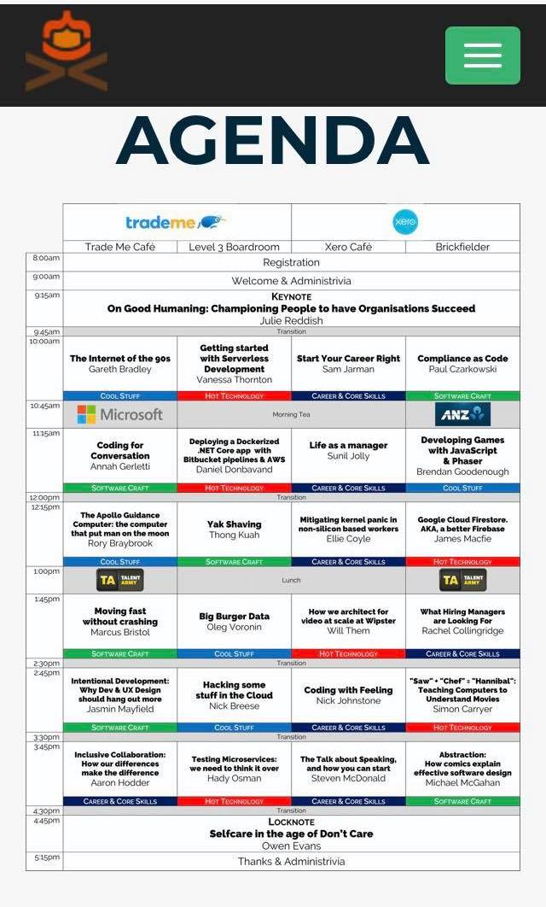

# Notes on sharing by speakers during Code Camp Wellington 2018
* [Life as a manager](./life_as_manager.md)
  * speech by Sunil Jolly
* [Mitigating Kernel Panic in non silicone workers](./mitigating_kernel_panic.md)
  * speech by Ellie Coyle
* [What hiring managers are looking for?](what_hiring_managers_looking.md)
  * speech by Rachel Collingridge
* [Inclusive Collaboration: How our differences make the difference](inclusive_collaboration.md)
  * speech by Aaron Hodder
* [Selfcare in the age of Don't Care](how_to_selfcare.md)
  * speech by Owen Evans

-----

